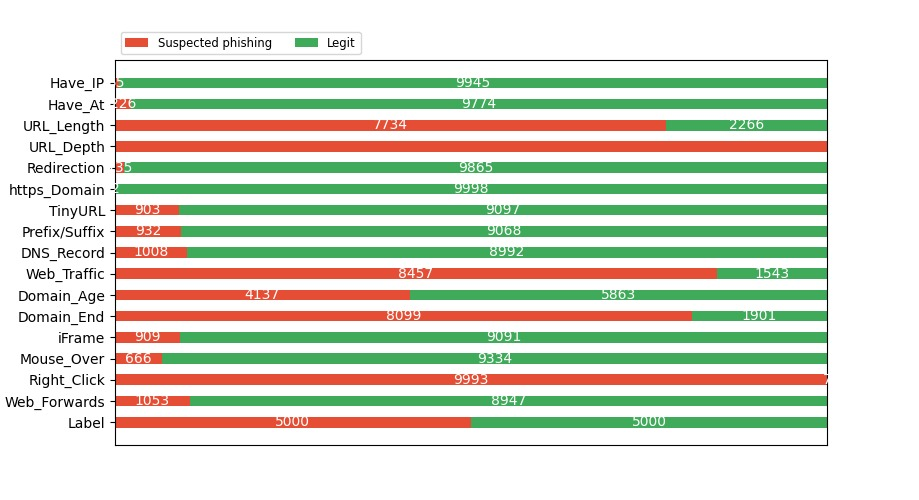
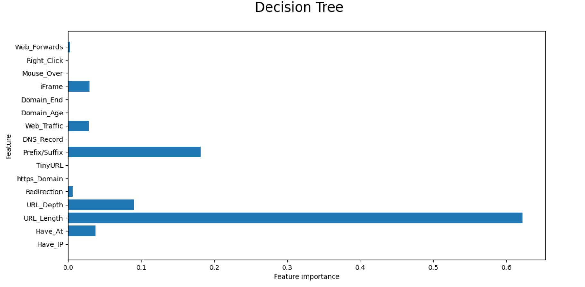
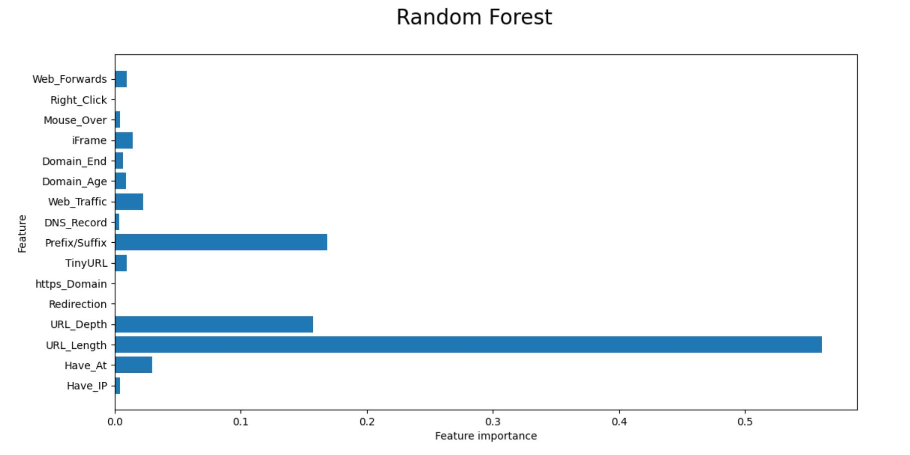
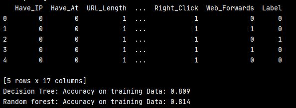
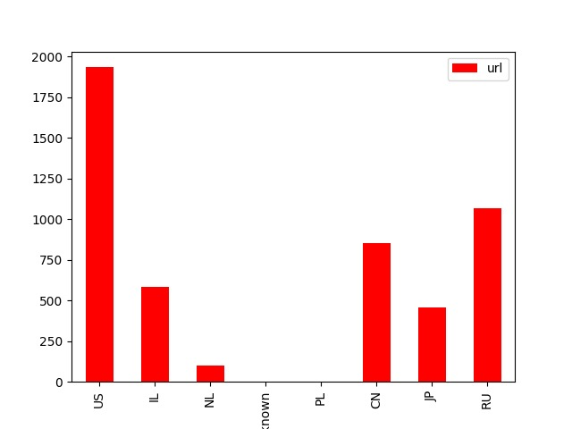

# Phishing Project

# Background

The reason I chose this project is because phishing has become a plague in the cyber world.
There are many approaches for how to attack this phenomena.

In this project, I will check if it's possible to predict if the URL is malicious using ML.

# Data Acquisition & Cleaning

1. The first step was to gather the data from 3 different sources:
  
    A. urlhaus-api.abuse.ch - for phishing domains.
    B. www.phishtank.com - for phishing domains.
    C. www.sites.google.com/site/top10000alexadomains/top-10000-alexa-domains - for valid domains.

2. The second step was to ingest the scraped data into csv files for working with pandas:
    
    A. legit urls CSV
    B. valid urls CSV

3. The third step was to divide the domains according to criteria
4. the forth step was to clean the data from any duplications and NULL fields

# visualizations
 
 Explaining the data through graphs:
 
 For example, the Legit vs. Phishing URLs by categories:

4. The fourth step is for entering the data into two models -
 A. Decision tree:

 B. Random forest:
       
 and choosing the best of the two:

5. The fifth step is to view a comparison of phishing domains by countries:

 
